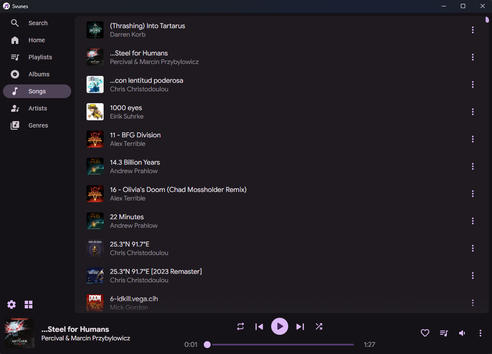
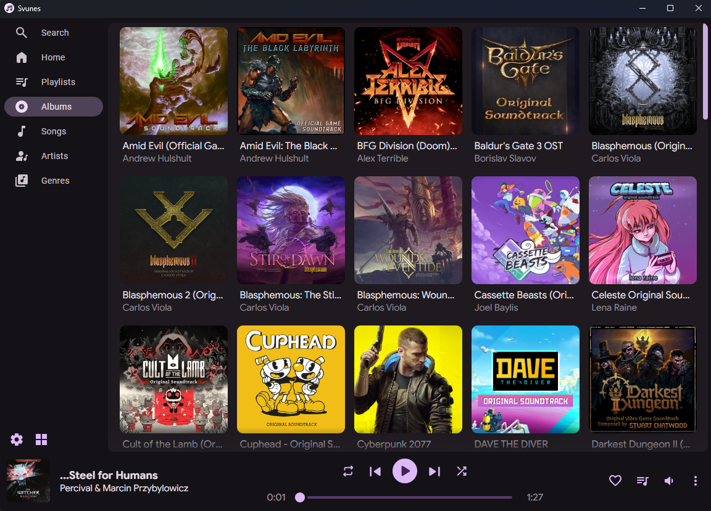

<h1 align="center">
  <a name="logo" href="https://svunes.org/"></a>
</h1>

<p align="center">
  <a href="https://github.com/Tormak9970/svunes/releases"></a>
  
  <a href="https://www.gnu.org/licenses/gpl-3.0.en.html"></a>
  <a href="https://crowdin.com/project/tunistic"></a>
  <br>
  <br>
</p>

# Svunes

An offline-first music player for your music library. Allows you to make playlists, view artists/albums, and more! Made with Svelte, Tauri, Rust, and Material Design 3.

# Installation

## Windows

### Full Releases
 - Download the `svunes.msi` file, and run it to install Svunes.

### Release Candidate
 - Download the `Svunes_vX.X.X.msi` file, and run it to install Svunes.

## Linux

### Full Releases
 - Download the `appimage-installer.sh` file, and run it to install Svunes.

### Release Candidate
 - Download the `Svunes_vX.X.X.AppImage` file.

## Android
Coming soon

## Mac
Coming soon

## iOS
Coming soon


# Features

## Fast Load Times
Svunes leverages the performance of Rust and multi-threading to quickly load libraries with thousands of songs.

## Intuitive Navigation
You can browse by your albums, genres, artists, songs or search all of them. Its easy to customize the order of the navigation bar, as well as which pages are displayed.

### Mobile Views
| 	||     	|     	|
|:-----:|   :-----:   | :-----:	|:-----:|
| Home 	| Playlists 	| Search 	| Songs |

| 	||     	|     	|
|:-----: | :-----:	| :-----:	| :-----:	  |
| Albums | Artists 	| Genres 	| Settings 	|

### Desktop Views
| |  |  |
|   :-----:   | :-----:	|:-----:|
| Playlists 	| Search 	| Songs |

|  |  |  |
|:-----: | :-----:	| :-----:	|
| Albums | Artists 	| Genres 	|

## Now Playing Themes
There are four different Now Playing Themes to pick from, as well as whether to use a solid, gradient, or blurred background.
| 	||     	|     	|
| :-----: |      :-----:      |    :-----:     |:-----: |
| Normal (Blurr) 	| Card (Gradient) 	| Simple (Solid) | Full 	|

## Other Features
 - Customize the look of Svunes by choosing the app's primary color
 - AMOLED Dark Theme

 - Apple CarPlay / Android Auto Support
 - Bulk Share your songs

 - Personalized Home screen

 - Driving Mode (with an option to start/stop automatically)
 - Sleep Timer
 - Volume Controls

 - Create your own playlists
 - Import/Export playlists

 - Tag Editing for Songs and Albums
 - Bulk Tag Editing
 - Filename -> Metadata Parser
 - Album Info and Cover Art Lookup (requires an internet connection)


# Frequently Asked Questions

**Q: Does Svunes report metrics or track anaylitics?**
No, everything stays on your device. The only tracking the app does is when songs have been played (for the History feature). This can be disabled in settings if you don't like it.

**Q: It says this is an offline music player, why does it need wifi for some features?**
The Album Info and Cover lookup require internet by nature, and are useful when trying to edit albums/songs.

**Q: Where are log files stored?**
The location is different for each platform, but in general:
 - **Windows:** `C:/Users/YOUR_USERNAME/AppData/Local/dev.travislane.svunes/logs/`
 - **Linux:** `/home/USER/.config/dev.travislane.svunes/logs/`

# Translations
If you're native language (or a language you speak) is not currently supported, please consider contributing to Svunes's translations! You can help by heading to [https://crowdin.com/project/svunes](https://crowdin.com/project/tunistic) and submitting translations. If a language is not listed there, please submit a GitHub issue and I will add it asap.


# Building Svunes
> **Please note:** you may edit and distrubute this program as you see fit but you must retain the license and the copyright notice I included (feel free to mark your contributions as I have). <br/>

### Setting Up the Enviroment
I used the Tauri framework for the program, so you will need to to setup your enviroment as specified [here](https://v2.tauri.app/start/prerequisites/). Additionally, you need a [Node.js](https://nodejs.org/en/) installation, as well as [bun](https://bun.sh/).

### Cloning the Program
The next step is to get a local copy of the repository. This can be done many ways, I recommend forking this repository and cloning that. <br/>

> **IMPORTANT:**<br/>
If you make changes you are not allowed to redistribute the application with me labeled as the developer. Please remember to change the `author` information in the `package.json` and the related copyright information in `src-tauri/tauri.config.json` file. You should also update the copyright notice in `src/windows/main/Main.svelte`.

### Installing Dependencies
Once you have cloned the repository and opened it in your preffered Editor/IDE (I recommend [VSCode](https://code.visualstudio.com/)), you will need to install the program's dependencies. To do this, you will need to run two commands: <br/>
First:<br/>
```
bun install
```
Next:<br/>
```
cd src-tauri
cargo install
```

### Running the Application
Now you are finally ready to get the app up and running! Assuming everything is set up correctly, all you need to do is run:<br/>
```
bun tauri dev
```

### Building With Your Changes
Once you have made your edits and are ready to share it with the world, run the following command:
```
bun run tauri build
```
This will generate a `.msi` file in `src-tauri/target/release/bundle/msi/app_name.msi`. And there you go, you've got a distributeable installer!

# Acknowledgements
APIs Used:
 - [MetaBrainz](https://beta.musicbrainz.org/doc/About) - Used for automatic song/album information lookup and covers.

References:
 - [How Spotify's Shuffle Works](https://engineering.atspotify.com/2014/02/how-to-shuffle-songs/) - An explanation of how pseudo-randomness can make shuffling feel more random.
 - [Metro](https://github.com/MuntashirAkon/Metro) - Inspired the UI scheme and the project as a whole.
 - [Svelte Md3](https://ktibow.github.io/m3-svelte/) - Many of the base components are heavily modified version of components from Svelte Md3.
 - [Musicat](https://github.com/basharovV/musicat) - Great resource for figuring out how to handle audio playback on the backend.
 - [svelte-tooltips](https://github.com/svelte-plugins/tooltips) - Starting point for how the app's speaker and volume options work

Libraries:
 - [Material Icons](https://fonts.google.com/icons) - All of the app's icons came from here.
 - [Fontawesome Icons](https://fontawesome.com/) - The app's logo uses one of fontawesome's icons.

# License
 - This program is licensed under the [GNU General Public License Version 3](https://www.gnu.org/licenses/#GPL)
 - Additionally, if you use Svunes for any projects, add it to a package manager, etc, please let me know!
 - Lastly, please provide appropriate credit for code usage

Copyright Travis Lane